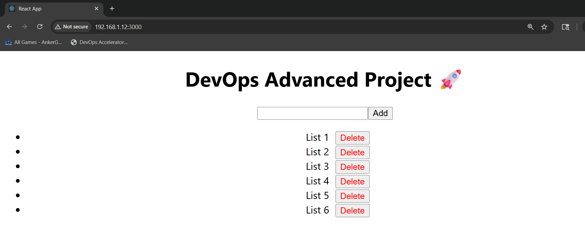
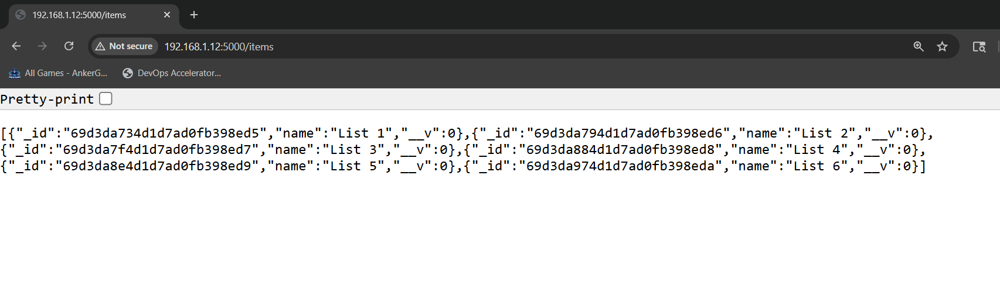

# 🚀 Advanced DevOps Micr`oservices Project

## 📌 Overview
This project demonstrates a production-style DevOps setup using a microservices architecture with full CRUD functionality.

---

## 🧱 Architecture
Frontend (React) → Backend (Node.js API) → MongoDB Database  

All services are containerized using Docker and orchestrated with Docker Compose.

---

## ⚙️ Tech Stack

- Docker
- Node.js (Express)
- React
- MongoDB

---

## 🚀 Features

- Multi-container architecture using Docker
- REST API integration between frontend and backend
- Persistent storage with MongoDB
- Full CRUD functionality:
  - ➕ Add items
  - 📄 View items
  - ❌ Delete items (UI + API)
- Real-time UI updates after operations
- Container networking using service communication

---

## 📸 Screenshots

### Frontend UI


### Backend API Response


---

## ▶️ Run Locally

```bash
docker-compose up --build
